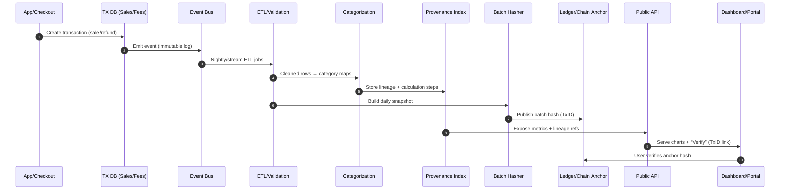

# Revenue Transparency Infrastructure Blueprint

## Overview
This blueprint defines a four-layer system to **store, show, and manage revenue transparency** for a new Ark-style, Amazon-like platform. The goal is to keep numbers **provable** (tamper-evident) and **human-readable** (clear to the public) without exposing sensitive competitive data.

---

## Architecture at a Glance (Mermaid)
```mermaid
flowchart TB
  subgraph L1[1) Data Capture & Verification]
    A[Transactional DB\n(PostgreSQL/Aurora)] --> B[Event Bus\n(Kafka/SNS/SQS)]
    C[Partner/Payment APIs] --> B
    D[Append-only Ledger Tables] --> E[Hash+Batches]
    E --> F[Immutable Anchor\n(QLDB/Hyperledger/Ethereum sidechain)]
  end

  subgraph L2[2) Transparency Processing]
    B --> G[ETL/ELT & Validation\n(dbt/Athena/Glue)]
    G --> H[Revenue Categorization Engine]
    H --> I[Provenance Index\n(calc lineage + raw refs)]
    H --> J[Privacy Guard\n(PII redact, GDPR/CCPA)]
  end

  subgraph L3[3) Public Presentation]
    I --> K[API Gateway / GraphQL]
    J --> K
    K --> L[Public Dashboard\n(Next.js + Charts)]
    K --> M[Open Data Portal\n(CSV/JSON APIs)]
    K --> N[Proof Viewer\n(block hash explorer)]
  end

  subgraph L4[4) Governance & Trust]
    O[Audit Scheduler] --> P[External Auditor]
    P --> Q[Audit Reports\n(PDF + signed hash)]
    Q --> L
    Q --> M
    R[Change Log & Policies] --> L
    R --> M
    S[Community Oversight\n(ticket + disclosure)] --> L
  end
```
---

## Layer Details

### 1) Data Capture & Verification
- **Transactional DB**: PostgreSQL/MySQL/AWS Aurora with **append-only** patterns for financial tables (no hard deletes).
- **Event Bus**: Stream all mutations (sales, refunds, fees, vendor payouts) to Kafka/SNS/SQS for consistent downstream processing.
- **Immutable Anchor**: Batch-hash daily financial snapshots; anchor on **Amazon QLDB** or a **permissioned chain**. Publish the hash to the public dashboard for tamper-evidence.

### 2) Transparency Processing
- **ETL/ELT**: Use dbt/Glue/Athena to transform raw transactions; enforce schema & reconciliation checks.
- **Revenue Categorization Engine**: Deterministic mapping rules + anomaly detection.
- **Provenance Index**: Each published metric stores: *input tables → transforms → timestamp → hash*. Every number has a “show your work” link.
- **Privacy Guard**: Drop/obfuscate PII at the boundary before anything hits public APIs.

### 3) Public Presentation
- **API Gateway/GraphQL**: Read-only endpoints with signed responses (include the data batch hash).
- **Dashboard**: Next.js/React with time filters, drilldowns, and **“Verify”** buttons that reveal the corresponding anchor hash and methodology.
- **Open Data Portal**: CSV/JSON with **rate limits** and **delayed** (e.g., T+7) granular data for safety.
- **Proof Viewer**: Minimal block/ledger explorer UI to check hashes against anchors.

### 4) Governance & Trust
- **External Audit**: Quarterly/annual reviews; upload signed PDFs and show diff vs. previous methodology.
- **Change Log & Policies**: Public page describing definitions (revenue, gross vs. net, fees), and a versioned change log.
- **Community Oversight**: Public issues/requests with SLAs; resolved items cross-linked to metrics and commit hashes.

---

## Data Flow (Mermaid)

---

## API Sketch (GraphQL example)
```graphql
type Metric {
  id: ID!
  name: String!
  periodStart: Date!
  periodEnd: Date!
  value: Float!
  currency: String!
  batchHash: String!        # For anchor verification
  lineageUrl: String!       # Human-readable provenance page
  methodVersion: String!    # Transparency policy version
}

type Query {
  revenueSummary(range: String!, granularity: String!): [Metric!]!
  categoryBreakdown(range: String!): [Metric!]!
  verify(hash: String!): VerificationResult!
}

type VerificationResult {
  hash: String!
  anchoredAt: DateTime!
  anchorNetwork: String!     # e.g., QLDB, Hyperledger, L2
  anchorTxId: String!
  status: String!            # valid | mismatch | unknown
}
```

---

## Minimal Viable Implementation (MVP)
1. **Aurora/Postgres** (financial tables with append-only triggers).  
2. **Nightly snapshot + SHA-256 hash** (Python cron/Lambda) → **QLDB anchor**.  
3. **Next.js dashboard** with:
   - Revenue (D/M/Y), category breakdown, returns/fees.
   - **Verify** button → displays the **anchor TxID** and the **snapshot hash**.
   - **Methodology** & **Change Log** pages.
4. **Quarterly audit**: upload signed PDF + publish its hash.

---

## Security & Privacy Controls
- Row-level security for vendor-facing drilldowns.
- PII boundary: redact or tokenize before public export.
- Least-privilege roles for ETL and APIs; read-only replica for public endpoints.
- Rate limiting and T+7 delay on granular exports.
- Continuous reconciliation jobs to detect drift between DB and published metrics.

---

## Example Folder Structure
```
/transparency
  /infra              # IaC: Terraform/CDK for DB, QLDB, API Gateway, Lambdas
  /etl                # dbt models, Glue jobs, validation tests
  /services
    /hasher           # snapshot + hash + anchor code
    /api              # GraphQL/REST read-only endpoints
  /web                # Next.js dashboard + proof viewer
  /audits             # Published audit PDFs + their hashes
  /policies           # Transparency policy + changelog (versioned)
```

---

## Design Principle
> Transparency only works if it is **provable** *and* **human-readable**.  
> A verifiable data chain + a clear public view = durable trust.

---

## Next Steps Checklist
- [ ] Define revenue definitions & disclosure policy v1.0
- [ ] Implement append-only patterns in financial tables
- [ ] Build nightly snapshot + hash + anchor service
- [ ] Publish v0.1 dashboard with Verify & Methodology pages
- [ ] Engage external auditor; publish first report
